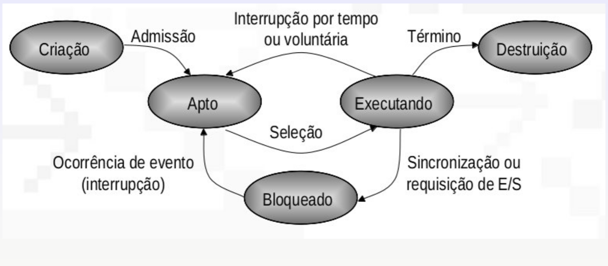
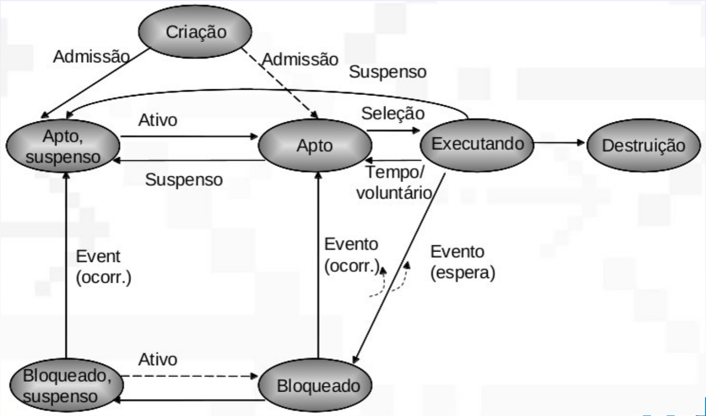

# Processos

## Processo x Programa

- Programa
  - Entidade estática e permanente
  - Sequência de instruções
  - Passivo sob o ponto de vista do SO
- Processo
  - Entidade dinâmica e efêmera
  - Altera seu estado a medida que avança sua execução
  - Composto por programa (código), dados e contexto (valores)
  - Abstração que representa um programa em execução
  - Forma como o SO enxerga um programa e possibilita sua execução

Um programa pode ter várias instâncias (diferentes processos) em execução. O
código é o mesmo mas os dados e os momentos de execução são diferentes.

Processos executam programas de usuário e do próprio sistema opracional
(daemons).

## Cliclo de vida de um processo

- Criação
  - Momento em que o prgrama é executado
  - Pode ser feito via chamada de sistema
  - O processo é indentificado por um número único (PID) quando é criado
- Execução
  - Tem dois tipos de ciclo
    - Ciclo de processador
      - Está usando a CPU
    - Ciclo de entrada e saída
      - Está esperando pela conslusão de um evento
  - O primeiro ciclo é sempre de processador
  - As trocas de ciclo ocorrem por meio de chamada de sistema (CPU para E/S) ou
    por interrupção (E/S para CPU)
- Término
  - É o fim da execução
  - Pode ocorrer de forma normal ou por erros

## Tipos de processo

- CPU bound
  - Tem mais ciclos de processador do que de entrada e saída
- I/O bound
  - Tem mais ciclos de entrada e saída do que de processador

## Relacionamento entre processos

- Processos independentes
  - Não apresentam relacionamentos com outras pessoas
- Grupo de processos
  - Aprensentam algum tipo de relacionamento
  - Podem compartilhar recursos

### Hierarquia

- Hierarquia de processos
  - Processo criador é o processo pai
  - Processo criado é o processo filho
- Representação através de árvore

Quando um processo é destruído ocorre uma de três coisas com seus filhos:

- Todos eles são destruídos também
- Eles são herdados pelo processo avô
- A destruição efetiva do processo pai é adiada até os processos filhos
  finalizarem.

## Estados de um processo

### Modelo simplificado (dois estados)

Após criado o processo necessita entrar em ciclo de processador, porém o
processador pode não estar disponível ou há muitos processos sendo criados,
havendo uma competição alta pelo processador, isso faz necessário a criação de
uma lista de processos aptos.

- Fila de processos aptos
  - Processos esperando o processador ficar livre para executar
- Escalonador (dispatcher)
  - Atribui o processador a um dos processos da fila de aptos
  - Pode previnir que um único processo use o processador indefinidamente

#### Limitações do modelo simplificado

- Causas para um processo não executar
  - Esperando o processador
    - Apto
  - Esperando pela ocorrência de eventos externos
    - Bloqueado
- Escalonador não pode selecionar um processo bloqueado, então o modelo de dois
  estados não é suficiente

### Modelo de 5 estados

- Criação (new)
- Apto (ready)
- Executando (running)
- Bloqueado (blocked)
- Destruição (exit)

### Processos suspensos

Quando há tantos processos abertos que a memória toda fica ocupada é preciso
liberar espaço transferindo alguns desses processos para o disco (swap).

- Necessidade de novos estados
  - Bloqueado, suspenso
  - Apto, suspenso

#### Razões para suspender um processo

- Swapping
  - SO precisa liberar espaço na memória para executar um novo processo
- Solicitação do usuário
  - Comportamento típico de depuradores
- Temporização
  - Processo teve sua execução interrompida por um certo período de tempo
- Um processo suspendendo o outro

## Implementação da multiprogramação

- A multiprogramação pressupõe a existência simultânea de vários processos
  disputando o processador
- Necessidade de intermediar essa disputa de forma justa
  - Gerência do processador
    - Algoritmos de escalonamento
      - Decide prioridade entre processos
- Necessidade de representar um processo
  - Implementação de processos
  - Estruturas de dados

### Representação de processo

- Processo é um programa em execução
  - Áreas na memória para código, dados e pilha
- Possui uma série de estados para representar sua evolução no tempo
  - Organizar os processos em diferentes estados
  - Determinar eventos que realizam a transição entre os estados
  - Determinar quando um processo tem direito a "utilizar" o processador
- Necessário manter informações sobre o processo
  - Prioridade
  - Localização em memória
  - Estado atual
  - Direitos de acesso
  - Recursos que emprega

### Bloco descritor de processo

- Process Control Block (PCB)
- Estrutura de dados que implementa abstração de processo
- Definição através de struct task_struct no linux

#### Informações normalmente presentes

- Prioridade
- Localização e tamanho na memória principal
- Identificação de arquivos abertos
- Informações de contabilidade
  - Tempo de CPU
  - Espaço de memória
- Estado do processador
  - Apto, executando, bloqueado, etc
- Contexto de execução
- Apontadores para encadeamento dos próprios descritores de processo

### Processos e filas

Um processo sempre faz parte de alguma fila, e os eventos realizam a transição
de uma para outra.

- Fila de livres
  - Número fixo (máximo) de processos
  - Alocação dinâmica
- Fila de aptos
- Fila de bloqueados

### Tarefas típicas do PCB durante o ciclo de vida

- Criação
  - Alocação de áreas da memória para o código, dados, pilha, e estruturas de
    dados do sistema operacional
  - Inicialização do descritor de processo e inserção em filas do sistema
- Execução
  - Realizam as instruções da área de código
  - Interação com o sistema operacional via chamadas de sistema
  - Atualização do bloco descritor de processo
  - Retratar estados e recursos que evoluem dinamicamente com a execução
  - Suscetível ao acionamento do escalonador em resposta a eventos
- Término
  - Liberação de recursos e estruturas de dados utilizadas

## Gerenciando processos

Os processos são identificados por seu PID (Process Identifier).

### Criação

- Processo pai cria outros processos
- Processos filho podem criar outros processos

Em relação ao compartilhamento de recursos, três abordagens podem ser adotadas:

- Pai e filho compartilham os mesmos recursos
- Filho compartilha um subconjunto dos recursos pai
- Pai e filho não compartilham recursos

Em relação à execução, duas abordagens podem ser adotadas:

- Pai e filho executam concorrentemente
- Pai espera até que os filhos terminem

Em relação ao espaço de endereçamento, três abordagens podem ser adotadas:

- Filho é uma duplicata do pai
- Filho tem um novo programa carregado nele
- Processos se comunicam por meio de sinais

Exemplos em UNIX

- `fork` cria um novo processo
- `exec` é usado após o fork para sobrescrever o espaço de memória do processo
  com um novo programa

### Término

Normalmente os processos executam sua última instrução e pedem ao SO para ser
terminado (exit).

O pai pode terminar a execução do filho (kill) em algumas situações

- O filho excedeu os recursos alocados
- A tarefa definida para o filho não é mais requerida
- O pai foi terminado
  - Alguns SOs não permitem que o filho continue executando depois que o pai
    termina

## Threads

Thread é um fluxo de execução de um processo. É possível criar várias threads em
um mesmo processo para que diferentes partes do mesmo código sejam executadas
sem que haja a duplicação e troca de contexto.

### Multiprogramação pesada

- Custos de gerenciamento do modelo de processos
  - Criação do processo
  - Troca de contextos
  - Esquemas de proteção, memória virtual, etc.
- Os custos são fator limitante na interação de processos
  - Unidade de manipulação é o processo
  - Mecanismos de IPC (Inter Process Communications) necessitam de tratamento de
    estruturas complexas que representam o processo e suas propriedades
- A solução é aliviar os custos, ou seja, reduzir o “peso” das estruturas envolvidas

### Multiprogramação leve

- Fornecido pela abstração de um fluxo de execução (thread)
  - Basicamente o conceito de processo
- Unidade de interação passa a ser função
- Contexto de uma thread
  - Registradores (pilha, apontador de programa, registradores de uso geral)
- Comunicação através do compartilhamento direto da área de dados

### Implementação de threads

Threads são implementadas através de estruturas de dados similares ao descritor
de processo.

- Descritor de threads
- Menos complexa (mais leve)

Threads podem ser implementadas em dois níveis

- Espaço de usuário
- Espaço de sistema

Modelos de sistema multithread

- Many to one
- One to one
- Many to many

#### Many to one (N:1)

- Threads a nível de usuário
  - Também chamado de "user level threads" ou "process scope"
  - O sistema não enxerga as threads como processos diferentes
  - O processo precisa dividir o tempo de uso do processador entre as threads
- O gerenciamento das threads é feito a nível de aplicação
  - Threads implementadas por uma biblioteca ligada ao programa
  - API para funções relacionadas com threads
- A troca de contexto é feita em modo usuário pelo escalonador embutido na
  biblioteca
  - Não precisa de privilégios especiais
  - Escalonamento depende da implementação

Vantagens

- O sistema operacional divide o tempo do processador entre os processos pesados
  e a biblioteca divide o tempo entre as threads
- Não precisa de intervenção do sistema operacional

Desvantagens

- Uma thread que realiza uma chamada de sistema bloqueante leva ao bloqueio de
  todo o processo
- Não explora o paralelismo em máquinas multiprocessadoras

#### One to one (1:1)

- Threads a nível de sistema
  - Também chamado de "kernel level threads" ou "system scope"
- Resolve desvantagens do modelo many to one
- O sistema operacional enxerga as threads
  - O sistema mantém informações sobre os processos e as threads
  - A troca de contexto necessita de intervenção do SO
- O conceito de threads é considerado na implementação do sistema operacional

Vantagens

- Explora o paralelismo de máquinas multiprocessadoras (SMP)
- Os cálculos ajudam a simplificar as operações de entrada/saída.

Desvantagens

- Implementação “mais pesada” que o modelo N:1

#### Many to many (M:N)

- Combina os modelos 1:1 e 1:N
- Oferece dois níveis de escalonamento
  - Nível usuário: threads sobre unidade de escalonamento
  - Nível sistema: unidades de escalonamento sobre processador
- Dificuldade em parametrizar M e N

### Por que usar threads?

- Permite a exploração do paralelismo real oferecido por máquinas
  multiprocessadores (modelo M:N ou 1:1)
- Aumenta o número de atividades executadas por unidade de tempo (throughput)
- Diminui o tempo de resposta
- Possibilidade de associar threads a dispositivos de entrada/saı́da
- Sobrepõe operações de cálculo com operações de entrada e saı́da

### Vantagens do multithreading

- O tempo de criação e destruição de threads é inferior que tempo de criação e
  destruição de um processo
- Chaveamento de contexto entre threads é mais rápido que tempo de chaveamento
  entre processos
- As threads compartilham o mesmo descritor de processo, o que significa que
  elas possuem o mesmo espaço de endereçamento. Isso possibilita a comunicação
  por memória compartilhada sem a necessidade de interação com o núcleo do
  sistema.
