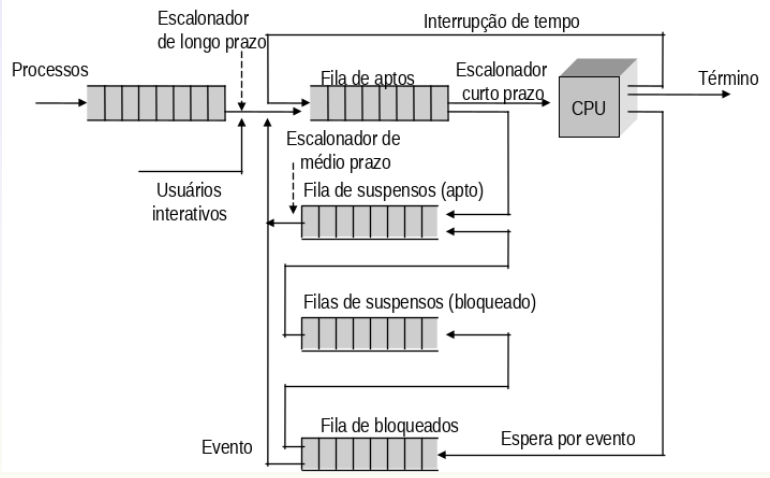

# Escalonamento de processos

- O **escalonador** é a entidade responsável por selecionar um processo apto
  para executar no processador
- Tem por objetivo dividir o tempo de uso do processador de forma justa
- É composto por duas partes
  - Escalonador
    - Política de seleção
  - Dispatcher
    - Efetua a troca de contexto

## Objetivo

- Maximizar o uso do processador
- Maximizar o número de processos executados por unidade de tempo
- Minimizar o tempo de execução total para um processo
- Minimizar o tempo de espera de um processo na fila de aptos
- Minimizar o tempo entre uma requisição e sua realização

## Situações para a execução do escalonador

- Sempre que a CPU estiver livre e tiver processos aptos a executar
- Criação e término de processos
- Um processo de maior prioridade fica apto
- Interrupções de tempo máximo
- Interrupções de entrada e saída
- Interrupção por falta de memória
- Interrupção por erros

## Dispatcher (ou despachante)

- Módulo que fornece o controle da CPU ao processo selecionado pelo escalonador
- Envolve
  - Troca de contexto
  - Mudança para o modo usuário
  - Desvio para o endereço adequado no programa do usuário
- Latência
  - Tempo que o dispatcher leva para interromper um processo e iniciar outro

## Níveis de escalonamento

### Longo prazo

- Executado quando um novo processo é criado
- Determina quando um processo novo passa a ser apto
  - Controle de admissão
- Controla o grau de multiprogramação do sistema

### Médio prazo

- Associado a gerência de memória
  - Participa do memory swap
- Suporte adicional a multiprogramação
  - Diferencia procesos aptos dos aptos-suspensos

### Curto prazo

- Determina qual processo apto deve usar o processador
- Decisões de escalonamento da CPU ocorrem quando...
  - Não preemptivas
    - ...o processo muda de executando para bloqueado
    - ...o processo muda de executando para apto
    - ...o processo muda de bloquado para apto
    - ...o processo termina
  - Preemptivas
    - ...há interrupção do relógio
    - ...há interrupção de entrada/saída
    - ...há chamadas de sistema
    - ...ocorrem sinais (interrupção de software)

## Tipos de escalonadores

- Após escalonado o processo usa o processador até...
  - ...terminar sua execução
  - ...executar uma entrada/saída ou sincronização
  - ...liberar a CPU voluntariamente
  - ...ocorrer interrupção de relógio (apenas peemptivos)
  - ...um processo de maior prioridade ficar apto (apenas peemptivos)

## Algoritmos de escalonamento

- Seleciona qual processo devev executar em um determinado momento
- Buscam obter bons tempos médios ao invés de maximizar ou minimizar um critério
  específico e/ou privilegiar a variância em relação a tempos médios

### Não preemptivos

#### First-in first-out (FIFO) ou First-come first-served (FCFS)

- Processos aptos são inseridos no final da fila
- Processo no começo da fila é o próximo a executar
- O processo executa até...
  - ...liberar explicitamente o processador
  - ...realizar uma chamada de sistema
  - ...terminar sua execução
- Desvantagens
  - Prejudica processos I/O bound

#### Shortest job first (SJF) ou Shortest process next (SPN)

- Originado do fato de que o menor tempo médio é obtido quando os processos que
  usam menos o processador são executados primeiro
- Fornece o menor tempo médio de espera
- Processos I/O bound são favorecidos
- Há dificuldade em determinar o tempo do próximo ciclo de CPU do próximo
  processo
  - Prever o tempo com base nos ciclos já passados e realizando uma média
    exponencial
- Pode ser empregado em processos batch

## $$\tau_{n+1} = \alpha t_n + (1 - \alpha) \tau_n $$

> $\tau_{n+1}$ Valor previsto para o próximo ciclo de CPU
>
> $\alpha$ Peso do tempo do cilco anterior no cálculo
>
> $t_n$ Tempo do ciclo $n$ de CPU
>
> $\tau_n$ Tempo previsto para o ciclo $n$

### Preemptivos

#### Round robin (circular)

- Similar ao FIFO porém tem limite de tempo por ciclo
  - O limite se chama quantum
  - Normalmente o quantum é de 10 a 100 milissegundos
- Fila circular de processos aptos
- O tempo médio depende do quantum e do número de processos aptos
- Problemas
  - Dimensionamento do quantum
  - Processos I/O bound prejudicados

#### Baseado em prioridades

- Sempre que um processo de maior prioridade que o processo atualmente em
  execucão se torna apto ocorre a preempção
- O escalonador seve selecionar o processo de mais alta prioridade segundo uma
  política
  - Round robin
  - FIFO
  - SJF
- Multiplas filas associadas ao estado apto
- Cada fila com uma prioridade
- Cada fila pode ter uma política de escalonamento diferente

#### Exemplo: Escalonamento FIFO com prioridade

- Quando um processo em execução é preemptado ele é inserido no início de sua
  fila de prioridade
- Quando um processo bloqueado passa a apto ele é inserido no final da fila de
  sua prioridade
- Quando um processo muda de prioridade ele é inserido no fim da fila de sua
  nova prioridade
- Quando um processo em execução passa a vez para um outro processo ele é
  inserido no final da fila de sua prioridade

#### Exemplo de alocação com múltiplas filas

- Fila de processos prontos é particionada em duas filas
  - Primeiro plano (interativo)
  - Segundo plano (batch)
- Cada fila tem seu algoritmo de escalonamento
  - Interativo - RR
  - Batch - FIFO
- O escalonamento deve ser realizado entre as filas
  - Escalonamento de prioridade fixa
    - Possibilidade de starvation
  - Fatia de tempo: cada fila recebe certa quantia de tempo de CPU que poderia
    ser então alocada aos processos dessa fila

## Como definir a prioridade de um processo

- Prioridade estática
  - O processo recebe uma prioridade quando é criado e fica com ela até terminar
- Prioridade dinâmica
  - A prioridade do processo é ajustada de acordo com o estado de execução do
    processo e/ou do sistema
  - Ajustar a prioridade em função da fração do quantum que o processo utilizou
    - Quando menor o valor, maior a prioridade
      - Processo A usou 2ms de 100ms, sua nova prioridade é 1/0.02 = 50
      - Processo B usou 50ms de 100ms, sua nova prioridade é 1/0.50 = 2
      - Processo B ganha uma prioridade maior que A
- Problemas
  - Um processo de baixa prioridade pode não ser executado
  - Um processo com prioridade estática pode não ficar mal classificado e ser
    penalizado ou favorecido em relação aos demais

### Multiplas filas com realimentação

- Baseado em prioridades dinâmicas
- Sistema de envelhecimento evita a postergação indefinida
- Escalonamento com múltiplas filas e tranferências entre as filas é definido
  por alguns fatores
  - Número de filas
  - Algoritmos de escalonamento para cada fila
  - Método usado para determinar quando transferir um processo para uma fila de
    prioridade mais alta e mais baixa
  - Método usado para determinar em qual fila o processo deve ser colocado
    quando precisar da CPU

#### Exemplo

- Três filas
  - Fila 0
    - RR com quantum de 8ms
  - Fila 1
    - RR com quantum de 16ms
  - FIla 2
    - FCFS
- Escalonamento
  - Um novo job entra na fila 0, que usa RR
  - Quando ele ganha a CPU, o JOB recebe 8ms
  - Se ele não finalizar em 8ms, é movido para a fila 1
  - Na fila 1 ele é servido novamente pelo RR e recebe 16ms, se ainda assim não
    completar, é movido para a fila 2

### Escalonamento não preemptivo com prioridades

- SJF é uma forma de priorizar processos
- Processos com mesma prioridade são executados com uma política FIFO
- Problema de postergação indefinida
  - Solução: envelhecimento
- O conceito de prioridade é mais "consistente" com preempção
